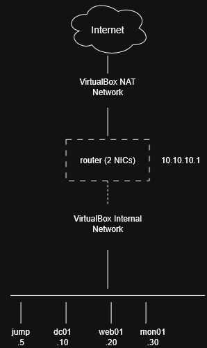

# mini-datacenter-project

## Network Design

The lab simulates a small segmented office network, isolated from the host
laptop and from the existing production server, running entirely inside
VirtualBox.

### Addressing

| VM | Hostname | IP Address | Role |
|---|---|---|---|
| Router/Firewall | `router` | 10.10.10.1 | Gateway, DHCP, DNS, firewall |
| Domain Services | `dc01` | 10.10.10.10 | Backup DNS, NTP |
| Web Server | `web01` | 10.10.10.20 | Reverse proxy + application |
| Monitoring | `mon01` | 10.10.10.30 | Prometheus, Grafana, Loki |
| Jump Box | `jump` | 10.10.10.5 | Sole SSH entry point (bastion) |

Network: `10.10.10.0/24`

Static IPs were chosen over DHCP-assigned addresses for all lab hosts, since
a fixed, documented addressing scheme is standard practice for
infrastructure that needs to be reliably reachable and audited — DHCP is
reserved for cases where that's genuinely useful.

### Topology

The `router` VM is dual-homed:
- **WAN** interface on a VirtualBox NAT Network, providing the lab's only
  path to the internet
- **LAN** interface on a VirtualBox Internal Network (`10.10.10.0/24`),
  which every other VM sits on

All other VMs have a single NIC on the internal network only. They have no
direct route to the internet or to the host machine — all traffic in or out
passes through `router`, which will handle firewalling and NAT.
This mirrors how a real network segments internal servers behind a
firewall/gateway, rather than exposing each host directly.
